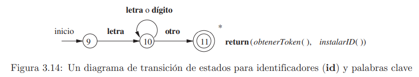

[< Regresar al Índice](README.md)

# Análisis Léxico

## Conceptos básicos
- **Token:** Unidad léxica o atributo
- **Patrón:** Descripción de un lexema.
- **Lexema:** Secuencia de caracteres del programa fuente.

Analizador léxico obtiene **tokens** del código fuente. Los tokens salen de los lexemas contenidos en el código y que corresponden al lenguaje de programación.

|Código|Lexemas|Tokens|
|:--:|:--:|:--:|
|int num = 12;|int <br/> num <br/> =<br/> 12<br/>; | int -> reservada <br/>num -> id<br/>= -> =<br/>12 -> entero<br/>; -> reservada

Estos tokens se le dan al analizador sintáctico, el cual analiza que la sintaxis de estos tokens sea correcta.

Ambos comparten la tabla de símbolos que salen a partir del análisis sintáctico.

# Proceso
1. **Preprocesamiento:** 
    - Quita comentarios
    - Quita saltos de líneas
    - Quita caracteres de separación

# Tabla de símbolos
La tabla de símbolos es una tabla en la que se almacenan los identificadores del programa, el analizador léxico y sintáctico construyen estan tabla.

```c
posicion = incial + velocidad * 60
```
Tabla de símbolos
|id|nombre|
|--|------|
|1|posicion|
|2|inicial|
|3|velocidad|

Se considera como   

```c
id(1) = id(2) + id(3) * 60
```

# Reconocimiento de Tokens
Cuando hablamos de una gramática, nos referimos a la estructura de un lenguaje para realizar algo. Por ejemplo.


La gramática, entonces, se compone por una colección de tokens definidos en el lenguaje.


## Diagrama de Transición de estados
Los diagramas de transición de estados son un diagrama de máquina de estados o de autómata finito que representa la manera de reconocer lexemas o tokens.

Por ejemplo, el diagrama de transición para los operadores relacionales:


## Reconocimiento de palabras reservadas e identificadores
Para identificar palabras reservadas, existen dos maneras de hacerlo (generalmente)

1. Realizar diagramas de transición para cada uno de las palabras reservadas.

2. Realizar diagrama de transición para encontrar el patrón que tienen las palabras, una vez que se encuentra la palabra, se busca en la tabla de símbolos (en donde las palabras reservadas fueron cargadas previamente).


## Autómatas Finitos

Son la teoría detrás de las máquina de estados. Existen dos tipos, 

- **Autómatas finitos deterministas (AFD):** Todos los estados tienen solamente una transición por cada condición de transición. Es decir, no se puede transicionar a dos o más estados por la misma condición.
    - Solo tiene un estado final
- **Autómatas finitos no deterministas (AFN):** Pueden haber mas de una transición de un estado a otro con la misma condición de transición. 
    - Si tiene epsilon es AFN
    - Si tiene dos o más estados finales es un AFN


[Siguiente: Tokens >](./Tokens.md)