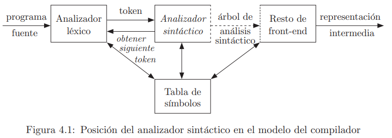
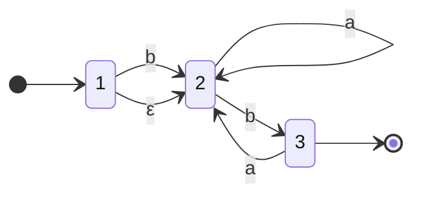

[< Regresar al Índice](README.md)

<br />

Tabla de Contenidos

- [1. Introducción](#1-introducción)
  - [1.1. Funciones del Analizador Sintáctico](#11-funciones-del-analizador-sintáctico)
- [2. Manejo de Errores](#2-manejo-de-errores)
  - [2.1. Objetivos del manejo de errores](#21-objetivos-del-manejo-de-errores)
  - [2.2. Estrategias de recuperación](#22-estrategias-de-recuperación)
- [3. Gramáticas](#3-gramáticas)
  - [3.1. Representación de Gramáticas](#31-representación-de-gramáticas)
  - [3.2. Gramáticas para Expresiones](#32-gramáticas-para-expresiones)
  - [3.3. Ambigüedad](#33-ambigüedad)
  - [3.4. Gramática libre de contexto](#34-gramática-libre-de-contexto)
    - [3.4.1. Producciones](#341-producciones)
      - [3.4.1.1. Terminales](#3411-terminales)
      - [3.4.1.2. No terminales](#3412-no-terminales)
      - [3.4.1.3. Terminales y no Terminales](#3413-terminales-y-no-terminales)
  - [3.5. Derivaciones](#35-derivaciones)
  - [3.6. Eliminación de Recursividad de una Gramática](#36-eliminación-de-recursividad-de-una-gramática)
    - [3.6.1. Recursividad por la izquierda](#361-recursividad-por-la-izquierda)
    - [3.6.2. Ejemplo](#362-ejemplo)
  - [3.7. Fatorización de Producciones](#37-fatorización-de-producciones)
    - [3.7.1. Ejemplo](#371-ejemplo)
- [4. Expresiones Regulares y Gramáticas](#4-expresiones-regulares-y-gramáticas)
  - [4.1. Conversión de un AFN a una gramática](#41-conversión-de-un-afn-a-una-gramática)


# 1. Introducción

La fase del análisis sintáctico se verifica que la manera en la que está escrito el programa sea correcta (por lo menos desde un punto de vista sintáctico).



## 1.1. Funciones del Analizador Sintáctico

1. Recoger Información sobre componentes léxicos en la tabla de símbolos
2. Realizar la verificación de tipo y otras clases de análsisi semántico.
3. Generar (algo de) código intermedio
4. Manejar errores


# 2. Manejo de Errores

Gran parte de la fase del analizador sintáctico es encontrar errores en el programa que impiden la correcta compilaciíon del mismo.

Algunos tipos de errores comunes son:
- Léxicos, escribir mal un id, operador o palabra clave.
- Sintáctico, paréntesis no equilibrados
- Semántico, un operador u operando no compatibles
- Lógico, recursión infinita

## 2.1. Objetivos del manejo de errores
- Informar de errores con claridad
- Recuperarse del error
- No retrasar programas que sí son correctos

## 2.2. Estrategias de recuperación 
- **Modo Pánico**
  - Desechar símbolos hasta encontrar un componente léxico de sincronización (delimitadores, palabras, o símbolos de terminación)
- **A nivel de frase**
  - Corregir con alguna cadena que permita continuar (.,;)
- **Producciones de error**
- **Corrección global**

# 3. Gramáticas
Son las relgas de cada lenguaje que indican la sintaxis correcta del mismo.

La sintaxis puede especificarse como gramáticas libres de contexto (notación BNF - Backus-Naur-Form)
- Especificación precisa y fácil de entender
- Puede eliminar ambigüedades

Una gramática permite que un lenguaje evolucione iterativamente, es decir, puede integrar facilmente nuevas construcciones.

Hay 3 tipos de **analizadores sintácticos**
- Métodos universales
  - Contemplan diferentes lenguajes, por lo que no son eficientes.
- Métodos Descendentes
  - Construyen el arbol de raíz a hojas
- Métodos Ascendentes
  - Construyen el arbol de hojas a raíz

Los métodos más eficientes trabajan con gramáticas LL (Left Left) LR (Left Right).

## 3.1. Representación de Gramáticas
Para indicar la sintaxis, por ejemplo, de un ciclo for, podríamos representar de la siguiente manera con una especie de expresión regular

```
while( condición ){ (sentencia;)+ }
```

## 3.2. Gramáticas para Expresiones
En estas **producciones**:
- **E:** Expresión
- **F:** Factor
- **T:** Término

$$
E\to E+T\;|\; T
$$
$$
T\to T\ast F\;|\; F
$$
$$
F\to (E)\;|\; id
$$

Se refiere a que lo que está del lado izquierdo puede ser sustituido por lo que está del lado derecho.

En el caso de los ejemplos 1 y 2, surgiría una recursividad (ya que el símbolo del lado izquierdo aparece también en el lado derecho).

## 3.3. Ambigüedad
Una gramática es ambigua si permite generar 2 o más árboles de una misma expresión.

## 3.4. Gramática libre de contexto

$$
instr \to \bold{if} (\;expr\;) \; instr \; \bold{else} \; instr
$$

If, else, () son terminales, tienen que aparecer literalmente así

Una gramática consiste en:
- Un conjunto de producciones que contienen
  - Terminales
    - Nombre del token o el token
  - No terminales
    - Variables sintácticas
  - Un símbolo inicial en la primera producción

### 3.4.1. Producciones
Indican cómo se deben combinar los terminales y no terminales para formar cadenas.

Cada producción se forma de 
- No terminal
- Símbolo de producción
  - $\to$
- Cuerpo
  - Combinación de terminales y/o no terminales

En este ejemplo

$$
E\to F
$$

- **No terminal:** E
- **Símbolo de producción**: $\to$
- **Cuerpo:** F

#### 3.4.1.1. Terminales
Son terminales los siguientes símbolos
- Las primeras letras minúsculas del alfabeto (a,b,c)
- Los símbolos de operadores (+,-, *)
- Símbolos de puntuación
- Dígitos
- Cadena en negrita

#### 3.4.1.2. No terminales
Son no terminales
- Primeras letras mayúsculas (A,B,C)
- La letra S o el simbolo inicial
- Nombres en cursiva como *instr* *expr*

#### 3.4.1.3. Terminales y no Terminales
Pueden existir combinaciones de terminales con no terminales

Se representan por
-  Letras griegas ($\alpha,\beta,\gamma$)
-  Ultimas letras del alfabeto mayúsculas (W,X,Y,Z)

## 3.5. Derivaciones
Las derivaciones se obtienen de las producciones de una gramática hasta llegar a una cadena.

Por ejemplo

Suponiendo la gramática 

$$
E \to E+E \; | \; E \ast E \; | \; -E \; | \; (E) \; | \; \bold{id}
$$

Encontrando las derivaciones para 

$$
-\bold{id}\ast(\bold{id}+\bold{id})
$$

Derivaciones:

$$
E\to E*E \to -E * E \to -\bold{id} * E \to -\bold{id} * (E) 
$$

$$
\to -\bold{id} * (E + E) \to -\bold{id} * (\bold{id} + E) \to -\bold{id} * (\bold{id} + \bold{id})
$$

## 3.6. Eliminación de Recursividad de una Gramática

### 3.6.1. Recursividad por la izquierda
Una gramática es recursiva por la izquierda si

$$
A \stackrel{+}{\Rightarrow} A\alpha
$$

- $\alpha$ cualquier combinación de terminales y no terminales
- $\beta$ cualquier combinación de terminales y no terminales que no contengan al no terminal del lado izquierdo.

Si una gramátcia es recursiva por la izquierda

$$
A \to A\alpha_1 | A\alpha_2 | ... | A\alpha_m | \beta_1 | beta_2 | ... | \beta_n
$$

Se escribe que $A$ produce a los elementos que no son recursivos, concatenándoles $A'$.

$A'$ por su cuenta, se escribe como la producción de los elementos que si son recursivos (quitándole la recursividad) y concatenándoles $A'$.

$$
A \to \beta_1 A' | \beta_2 A' | ... | \beta_n A'
$$
$$
A' \to \alpha_1 A' | \alpha_2 A' | ... | \alpha_m A' | \epsilon
$$

### 3.6.2. Ejemplo

$$
A \to A \; c \; | \; A \; a \; d \; | \; b \; d \; | \; \epsilon
$$

Eliminamos la recursividad inmediata **por la izquierda**.

$$
S \to A \; a \; | \; b
$$

$$
A \to b \; d \; A' \; | A'
$$

$$
A' \to c \; A' \; | \; a \; d \; A' \; | \; \epsilon
$$

## 3.7. Fatorización de Producciones

La factorización nos sirve para generar gramáticas que solo tienen un camino de evaluación inclusoc cuando hay elementos comunes entre sus producciones.

$$
S \to i \; E \; t \; S \; | \; i \; E \; t \; S \; e \; S \; | \; a
$$

$$
E \to b
$$

Supongamos esta gramática: if Expresión then Sentencia OR if Expresión then Sentencia else Sentencia OR algo mas

Podemos factorizar $i \; E \; t \; S$, ya que es común entre dos producciones.


Creamos un nuevo $S'$ que contiene la parte que no es común (o epsilon porque puede no estar) y lo concatenamos a la parte de la producción que es común.

$$
S \to i \; E \; t \; S \; S' \; | \; a
$$

$$
S' \to eS \; | \; \epsilon
$$

$$
E \to b
$$

Una gramática en la que se eliminó la recursividad y se factorizó (si fue necesario) se considera una gramática **LL(1)**, esto significa que solo se necesita leer un caracter adelante para que se pueda validar.

### 3.7.1. Ejemplo

Haremos una factorización por la izquierda de la siguiente gramática.
$$
instr \to if \; expr \; then \; instr \; | \; instrRelacionada
$$

$$
instrRelacionada \to if \; expr \; then \; instrRelacionada \; else \; instr \; | \; otra
$$

Aunque al inicio parece que no es posible factorizar, si sustituimos $instrRelacionada$ por su producción en la produción de $instr$, obtenemos lo siguiente.

$$
I \to i \; e \; t \; I \; | \; i \; e \; t \; I \; el \; I \; | \; o
$$

Aqui ya podemos observar que podemos factorizar por la izquierda, ya que existen los términos comunes $i \; e \; t \; I$.

Llegamos a la siguiente factorización:

$$
I \to i \; e \; t\; I \; I'
$$

$$
I' \to el \; I \; | \; \epsilon
$$

---

# 4. Expresiones Regulares y Gramáticas

## 4.1. Conversión de un AFN a una gramática
1. Para cada estado i del AFN, crear un no terminal $A_{i}$.
2. Si el estado i tiene una transición al estado j con la entrada a, agregar la producción $A_i \to A_j$.
3. Si i es un estado de aceptación (estado final), agregar $A_i \to \epsilon$
4. Si i es el estado inicial, hacer que $A_i$ sea el símbolo inicial de la gramática.

Ejemplo



$$
A_1 \to A_2 \; | \; bA_2
$$

$$
A_2 \to aA_2 \; | \; bA_3
$$

$$
A_3 \to aA_2 \; | \; \epsilon
$$


[Siguiente: Análisis sintáctico predictivo no recursivo >](./AnalisisSintacticoPredictivo.md)