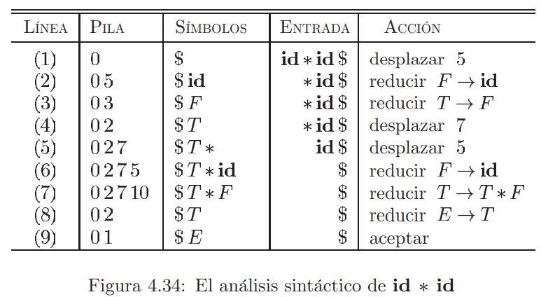

[< Regresar al Índice](README.md)

 

Tabla de Contenidos
- [1. Introducción](#1-introducción)
- [2. Mangos y Reducciones](#2-mangos-y-reducciones)
- [3. Gramática de Operadores](#3-gramática-de-operadores)
  - [3.1. Elección de Mangos](#31-elección-de-mangos)
- [4. Análisis LR(0)](#4-análisis-lr0)
  - [4.1. Estados del Análisis Ascendente](#41-estados-del-análisis-ascendente)

# 1. Introducción
Análisis sintáctico por *desplazamiento* y *reducción*, también se conoce como análisis de tipo **LR**.

En este tipo de análisis, las derivaciones se hacen primero por la **derecha** (a diferencia del análisis sintáctico descendente).

# 2. Mangos y Reducciones

Los mangos son subcadenas que concuerdan con el lado derecho de una producción, su reducción al no terminal es el **paso inverso** de una **derivación por la derecha**.

Una **reducción** es la operación inversa de una **derivación**.

**Ejemplo**

Suponiendo la siguiente gramática

$$
S \to aABe
$$

$$
A \to Abc | b
$$

$$
B \to d
$$

Reducción (operación inversa de las derivaciones) de la cadena `abbcde` hasta $S$.
- a**b**bcde
- a**A**bcde
- aAde
- aABe
- S

Que corresponde a la operación inversa de la siguiente derivación:

$$
S \to aABe \to aAde \to aAbcde \to abbcde
$$

> NOTA: Este tipo de análisis sintáctico no funciona bien en gramáticas no factorizadas y recursivas

# 3. Gramática de Operadores

No se pueden producir 2 no terminales juntos

Se usan para determinar el uso de operadores dentro del lenguaje. Como los operadores tienen una jerarquía, se especifica su precedencia con los siguientes símbolos.

Menos precedencia 
$$
\lessdot
$$

Misma precedencia
$$
\dot =
$$

Más precedencia
$$
\gtrdot
$$

## 3.1. Elección de Mangos

**Ejercicio**

Considerando esta tabla de precedencia

||id|+|*|$|
|-|-|-|-|-|
|id||$\gtrdot$|$\gtrdot$|$\gtrdot$|
|+|$\lessdot$|$\gtrdot$|$\lessdot$|$\gtrdot$|
|*|$\lessdot$|$\gtrdot$|$\gtrdot$|$\gtrdot$|
|$|$\lessdot$|$\lessdot$|$\lessdot$||

Evalua la siguiente cadena

$ id + id * id $

**Evaluación**

$$
\$ \lessdot id \gtrdot + \lessdot id \gtrdot * \lessdot id \gtrdot \$
$$

# 4. Análisis LR(0)

Una prouducción LR(0) tiene un punto en cierta posición

$$
A \to \centerdot XYZ
$$

## 4.1. Estados del Análisis Ascendente

- **Desplazar:** Mover el siguiente símbolo de la cadena de entrada a el conjunto de símbolos (columna de símbolos).
- **Reducir:** Sustituir símbolos en la columna de símbolos por un no terminal de la gramática.
- **Aceptar:** Se terminó el análisis sintáctico de manera satisfactoria.
- **Error:** Se encontró un error en el programa.

