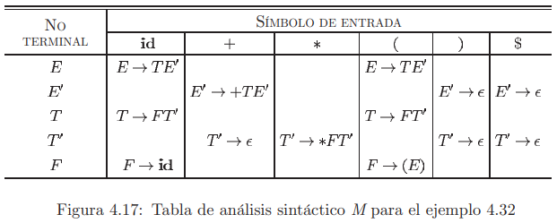
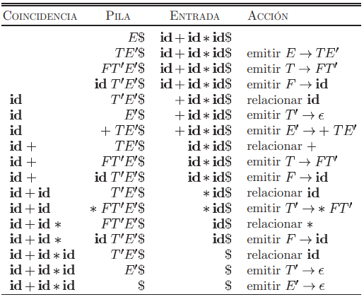

[< Regresar al Índice](README.md)

 

Tabla de Contenidos
- [1. Análisis sintáctico predictivo no recursivo](#1-análisis-sintáctico-predictivo-no-recursivo)
- [2. Tabla de Análisis Sintáctico](#2-tabla-de-análisis-sintáctico)
  - [2.1. Función Primero](#21-función-primero)
    - [2.1.1. Reglas](#211-reglas)
  - [2.2. Función Siguiente](#22-función-siguiente)
    - [2.2.1. Reglas](#221-reglas)
  - [2.3. Construcción de la Tabla de Análisis Sintáctico](#23-construcción-de-la-tabla-de-análisis-sintáctico)
    - [2.3.1. Reglas](#231-reglas)
      - [2.3.1.1. Regla 1](#2311-regla-1)
      - [2.3.1.2. Regla 2](#2312-regla-2)
      - [2.3.1.3. Regla 3](#2313-regla-3)
- [3. Algoritmo](#3-algoritmo)
  - [3.1. Ejemplo](#31-ejemplo)

# 1. Análisis sintáctico predictivo no recursivo

- Se elimina recursividad por la izquierda
- Se factoriza (si es necesario)

# 2. Tabla de Análisis Sintáctico
La tabla de análisis sintáctico es la que se usa para ejecutar el algoritmo de análisis sintáctico sobre un texto de entrada contra una gramática establecida para el lenguajes.

> **Nota Importante!**   
> Antes de comenzar con este procedimiento, se debió eliminar la recursividad de la gramática al igual de factorizar la misma en caso de ser necesario.

Para construir esta, es importate primero entender dos funciones:

## 2.1. Función Primero
La función $Primero(\alpha)$ regresa el primer no terminal o epsilon ($\epsilon$) de una gramática de una producción de $\alpha$.

Es decir, por ejemplo, si suponemos la siguiente producción

$$
E \to a
$$

$Primero(E)$ sería el terminal $a$.

### 2.1.1. Reglas
Existen algunas reglas o consideraciones con la funcion $Primero(\alpha)$.

1. Si $\alpha$ es terminal, entonces $Primero(\alpha)$ regresa un conjunto con $\alpha$
   1. $Primero(\alpha) = \lbrace \alpha \rbrace$
2. Si $\epsilon$ está en la producción de $\alpha$, entonces $\epsilon$ está en el conjunto que regresa $Primera(\alpha)$
   1. Si $\alpha \to \epsilon$
   2. Entonces, $Primera(\alpha) \to \lbrace \epsilon \rbrace$
3. Si $Primero(\alpha) = \lbrace E \rbrace$, donde $E$ es un no terminal, $Primero(\alpha) = Primero(E)$
4. Suponiendo una producción $X \to Y_1Y_2Y_3...$
   1. Si $Primero(Y_1)$ contiene $\epsilon$, se agrega $Primero(Y_2)$ y así sucesivamente.

Si una producción tiene 2 o más producciones separadas por $|$ (or), se evalúa cada una, es decir:

Si
$$
E \to x \; | \; a
$$

Entonces
$$
Primero(E) = \lbrace x, a \rbrace
$$

## 2.2. Función Siguiente
Para calcular la función $Siguiente(A)$, ahora buscamos $A$ del lado derecho de las producciones, siguiendo las siguientes reglas:

### 2.2.1. Reglas

1. Si $A$ es el signo inicial de la gramática (primer símbolo que aparece en la gramática), entonces $Siguiente(A) \to \lbrace \$ \rbrace$.
2. Si tenemos una producción de la forma $A \to \alpha B \beta$, entonces $Siguiente(B)$ contiene $Primero(\beta)$.
   1. Recordemos que $\alpha$ puede ser $\epsilon$, por lo que $A \to B\beta$, también cumple esta regla.
3. Si tenemos una producción como $A \to \alpha B$, entonces $Siguiente(B)$ contiene todo lo de $Siguiente(A)$.
   1. **Importante:** Una producción de la forma $A \to \alpha B \beta$ puede cumplir esta regla si $Primero(\beta)$ contiene $\epsilon$.

## 2.3. Construcción de la Tabla de Análisis Sintáctico
Una vez que hemos calculado todos los $Primeros$ y $Siguientes$, podemos construir la tabla de análisis sintáctico.

Creamos una tabla en la que los **no terminales** estén del lado izquierdo y los **terminales** en la parte superior.

||a|b|c|d|$|
|-|-|-|-|-|-|
|X| | | | | |
|Y| | | | | |
|Z| | | | | |

### 2.3.1. Reglas
Para rellenar la tabla, seguimos las siguientes reglas:

#### 2.3.1.1. Regla 1
Para cada terminal $a$ en $Primero(A)$, agregamos la producción que en la que aparece $a$ en la intersección de $A$ con $a$.

  Ejemplo, si 

  1. $Primero(A) = \lbrace a \rbrace$  
  2. En la gramática encontramos $A \to aT$

  Agregamos en nuestra tabla

||a|b|c|d|$|
|-|-|-|-|-|-|
|A|$A \to aT$| | | | |

#### 2.3.1.2. Regla 2
Si $\epsilon$ está en $Primero(A)$ (siendo $A$ cualquier no terminal de la gramática), entonces:

Para cada **no terminal** $b$ en $Siguiente(A)$, se agrega la producción de la gramática $A \to \alpha$ en la intersección de $A$ con $b$.

> Nota, también podemos considerar a $ como $b$.

 

**Ejemplo.**

Supongamos que tenemos la gramática:

$B \to bT'$

y 

$$
Primero(B) = \lbrace b, \epsilon \rbrace
$$

$$
Siguiente(B) = \lbrace \$, a, c \rbrace
$$

||a|b|c|d|$|
|-|-|-|-|-|-|
|B|$B \to bT'$| | $B \to bT'$| |$B \to bT'$ |

#### 2.3.1.3. Regla 3
Las entradas vacías en la tabla son producciones de error.

# 3. Algoritmo
Se establece una pila `P`, un input `w` y una tabla de análisis sintáctico `M` derivado de la gramática del lenguaje.

Consideramos que `X` es el elemento en la cima de la pila `P` y `a` es el caracter del input que se está evaluando actualmente.

1. Mientras `P` no esté vacía
   1. Si `X` es `a`
      1. **Pop** a la pila `P` y avanzar a la siguiente posición de `w`
   2. Si no pero `X` es un terminal
      1. Generar un error
   3. Si no pero el cruce de `X` con `a` en `M` es una entrada de error
      1. Generar un error
   4. Si no, pero el cruce de `X` con `a` en `M` es una producción
      1. **Pop** a la pila `P`
      2. **Push** la producción caracter por caracter a la pila `P`*

*Nota: Ya que se hace **push** caracter por caracter, si leemos la pila de arriba abajo nos encontramos con la producción al reves. Por ejemplo, si agregamos `abcde` a la pila, lo leeríamos como `edcba`.

## 3.1. Ejemplo

Dada la siguiente tabla de análisis sintáctico

Realiza el análisis sintáctico de la cadena `id+id*id$` ($ representa un caracter de fin de cadena).

