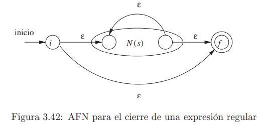

[< Regresar al Índice](README.md)

- [1. Autómatas Finitos](#1-autómatas-finitos)
  - [1.1. Construcción de AFN de una Expresión Regular](#11-construcción-de-afn-de-una-expresión-regular)
    - [1.1.1. Or](#111-or)
    - [1.1.2. Concatenación](#112-concatenación)
    - [1.1.3. Kleene](#113-kleene)
- [2. Convertir AFN a un AFD](#2-convertir-afn-a-un-afd)
  - [2.1. Convertir Expresión Regular a AFN](#21-convertir-expresión-regular-a-afn)
  - [2.2. Conjuntos de Estados AFN](#22-conjuntos-de-estados-afn)
  - [2.3. Tabla de Transiciones](#23-tabla-de-transiciones)
  - [2.4. Reducción de Estados](#24-reducción-de-estados)
  - [2.5. AFD Final](#25-afd-final)


# 1. Autómatas Finitos

Son la teoría detrás de las máquina de estados. Existen dos tipos, 

- **Autómatas finitos deterministas (AFD):** Todos los estados tienen solamente una transición por cada condición de transición. Es decir, no se puede transicionar a dos o más estados por la misma condición.
    - Solo tiene un estado final
- **Autómatas finitos no deterministas (AFN):** Pueden haber mas de una transición de un estado a otro con la misma condición de transición. 
    - Si tiene epsilon es AFN
    - Si tiene dos o más estados finales es un AFN

## 1.1. Construcción de AFN de una Expresión Regular
Podemos construi un AFN en base a una expresión regular siguiendo el algoritmo de McNaughton-Yamada-Thompson.
### 1.1.1. Or
Para s|t


### 1.1.2. Concatenación
Para st


### 1.1.3. Kleene
Para s*




# 2. Convertir AFN a un AFD
Para implementar un autómata en código, resulta mucho más sencillo y eficiente implementar **autómatas finitos deterministas**, a pesar de esto, los autómatas finitos no deterministas (AFD) son más fáciles de diseñar (por ejemplo, con el algoritmo de McNaughton-Yamada-Thompson.).

Podemos convertir un AFN a un AFD de la siguiente manera:

## 2.1. Convertir Expresión Regular a AFN

Partiendo de la expresión regular

```
d+(\.d+)?
```

Con el algoritmo de Thompson obtenemos el siguiente autómata


## 2.2. Conjuntos de Estados AFN

El siguiente paso es encontrar conjuntos de estados a través de los cuales obtenemos un símbolo específico.

Comenzamos por el conjunto **A**, en este conjunto incluimos todos los estados a los que podemos atravesar partiendo del estado inicial pasando unicamente por transiciones epsilon ($\epsilon$).

$$
A = \{1\}
$$

En este caso, unicamente podemos pasar a través del estado 1 (ya que el estado 2 no tiene transiciones con epsilon saliendo de el).

Ahora debemos formar conjuntos de los estados por los que podemos atravesar partiendo de los estados en $A$ de tal manera que obtengamos cada uno de los símbolos en la expresión regular.

Por ejemplo, partiendo desde $A$ para obtener $d$.

$$
(A,d) = \{2, 3, 4, 6, 5\} = B
$$

<details>
  <summary>Explicación</summary>
  
    El conjunto A contiene unicamente al estado 1, saliendo de este, podemos conseguir un d de la siguiente manera.

    1. De 1 a 2 no se genera d, ya que hay ε
    2. De 2 a 3 ya se genera d, por la transición d
    3. De 3 a 2 hay una transición ε, como ya generamos d, 2 entra en nuestro conjunto.
    4. De 3 a 4 hay una transición ε, como ya generamos d, 4 entra al conjunto.
    4. De 4 a 6 hay una transición ε, como ya generamos d, 6 entra al conjunto.
    4. De 6 a 5 hay una transición ε, como ya generamos d, 5 entra al conjunto.
</details>

<br/>

Como es un conjunto que no habíamos descubierto antes, lo nombramos $B$.

Ahora los estados a los que podemos llegar partiendo desde $A$ hasta conseguir $.$ (punto).

$$
(A, .) = \{\}
$$

Como no podemos obtener un punto partiendo de $A$, es un conjunto vacío.

---
Continuamos este procedimiento, ahora partiendo del conjunto $B$.

$$
(B, d) = \{3, 2, 4, 6, 5\} = C
$$

Como es un conjunto nuevo, lo nombramos $C$.

$$
(B, .) = \{5\} = D
$$

Como es un conjunto nuevo, lo nombramos $D$.

---
Continuamos ahora partiendo del conjunto $C$

$$
(C, d) = \{3, 2, 4, 6, 5\} = C
$$
Este conjunto es el mismo que el conjunto $C$.

$$
(C, .) = \{5\} = D
$$
Este conjunto es el mismo que el conjunto $D$.

---
Continuamos ahora partiendo del conjunto $D$

$$
(D, d) = \{5, 6\} = E
$$
Como es un conjunto nuevo, lo nombramos $E$.

$$
(D, .) = \{\}
$$
Como no podemos obtener un punto partiendo de $D$, es un conjunto vacío.

---
Continuamos ahora partiendo del conjunto $E$
$$
(E, d) = \{5, 6\} = E
$$
Como es un conjunto nuevo, lo nombramos $E$.

$$
(E, .) = \{\}
$$
Como no podemos obtener un punto partiendo de $E$, es un conjunto vacío.

<br/>

## 2.3. Tabla de Transiciones
Con lo obtenido en el paso pasado, podemos construir una tabla de transiciones

| |d|.|Final|
|-|-|-|-|
|**A**|B|||
|**B**|C|D|X|
|**C**|C|D|X|
|**D**|E|||
|**E**|E||X|

Los **conjuntos  o estados finales** son los conjuntos que tienen contenidos en ellos el estado final del AFN inicial.

En este caso, el conjunto B, C y E tienen al estado final 6.

## 2.4. Reducción de Estados
Podemos eliminar estados finales con finales y no finales con no finales siempre y cuando tengan **las mismas transiciones hacia los mismos estados**.

En el ejemplo anterior, podemos elminar al estado $C$ y reemplazarlo con el estado B, ya que:
- Ambos son finales
- Tienen una transición a $C$ por un $d$
- Tienen una transición a $D$ por un $.$

Al eliminarlo, todas las otras transiciones que antes iban a $C$ son reemplazadas por $B$ (el estado que lo reemplazó).

| |d|.|Final|
|-|-|-|-|
|**A**|B|||
|**B**|~~C~~ B|D|X|
|**D**|E|||
|**E**|E||X|

## 2.5. AFD Final


