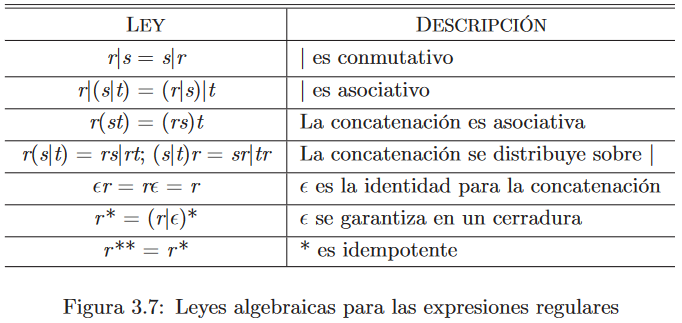

# 1. Expresiones Regulares

- [1. Expresiones Regulares](#1-expresiones-regulares)
  - [1.1. Ejemplos de Definiciones Regulares](#11-ejemplos-de-definiciones-regulares)

Las expresiones regulares representan una manera de representar patrones de cadenas.

1. $(r)|(s)$ denota $L(r) \cup L(s)$
2. $(r)(s)$ denota $L(r)L(s)$
3. $(r)*$ denota $(L(r))*$
4. $(r)$ denota $L(r)$
    1. podemos agregar pares de paréntesis sin cambiar el lenguaje que denota.

- `*` tiene la mayor prioridad y es asociativo por la izquierda.
- La **concatenación** tiene la segunda prioridad más alta y es asociativa por la izquierda.
- `|` tiene la menor precedencia y es asociativo por la izquierda.

Una expresión regular **r** denota un Lenguaje L(r) que tiene un cierto alfabeto, es decir, podemos suplir un alfabeto por un solo símbolo que lo represente.

--- 
Por ejemplo, si L(r) = {a,b}

La expresión regular **rr** podría ser {aa, bb, ab, ba}

--- 

Si un lenguaje se puede describir mediante una expresión regular, se le llama un **conjunto regular**.

## 1.1. Ejemplos de Definiciones Regulares
$$
a(a|b)*a
$$

Cualquier cadena que comienza por **a**, seguido por **a o b** 0 o más veces, que termina por **a**.

$$
((\epsilon|a)b*)*
$$

Cualquier cadena de 0 o más caracteres, constando de 0 o 1 **a**, concatenada con 0 o mas **b**.

[Siguiente: Análisis Léxico >](./AnalisisLexico.md)
