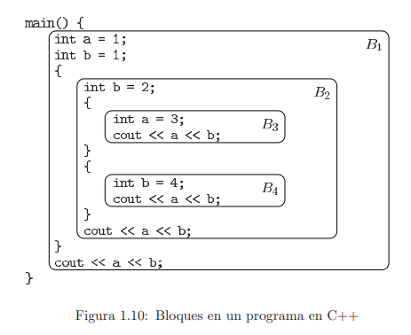

# Introducción
En esta sección exploraremos los conceptos básicos relacionados con compiladores y lenguajes de programación.

# Lenguajes de Programación
Los lenguajes de programación es una notación específica que se utiliza para escribir programas para computadoras.

En cuanto a su nivel de abstracción, se dividen en dos tipos:

## Lenguaje de alto nivel
Son lenguajes con un alto nivel de abstracción, que resultan más fáciles de escribir y razonar.

- Alta abstracción
- Fácil Programación
- Lentos de Ejecutar
- Portables

## Lenguaje de bajo nivel
- Más eficiente
- Difíciles de escribir
- Menos portables

# Ejecución de Código Fuente
Cuando un programador escribe una serie de instrucciones que serán ejecutadas por una computadora, por lo general lo hace en un **lenguaje de programación**, el cual no es entendible por la computadora directamente.

Es por esto que se necesita de alguna herramienta adicional para lograr que la computadora entienda y ejecute las instrucciones que le damos.

Para esto existen diferentes tipos de herramientas dependiendo del lenguaje de programación.

## Compiladores
Un compilador es un programa encargado de convertir código fuente (entendible por humanos) a código máquina (entendible por las computadoras.)

Los programas compilados resultan ser muy rápidos en su ejecución, ya que la computadora ejecuta las instrucciones directamente y no tiene que hacer ningún tipo de traducción (ya que la traducción fue hecha previamente al compilar).

Ejemplos de lenguajes de programación compilados son:

- C
- C++
- Rust
- Go

## Intérpretes
Los intérpretes son programas que ejecutan instrucciones del código fuente directamente, sin compilarlo a código de máquina.

Los programas interpretados suelen ser considerablemente más lentos en su ejecución en comparación a los programas compilados, ya que se realiza el análisis y "traducción" durante la ejecución.

Ejemplos de lenguajes interpretados son:

- Python
- Javascript
- Lua

## Compiladores Híbridos
Los compiladores híbridos son una mezcla de las dos anteriores.

En este tipo de lenguajes, si existe un compilador, pero este no compila a código máquina, sino a un código intermedio comúnmente llamado *"bytecode"*.

La ventaja de estos lenguajes es que se vuelven portables a múltiples plataformas.

Ejemplos de lenguajes con compiladores híbridos son:

- C#
- Java

# Programas de Apoyo para un Compilar
Cuando compilamos un programa, el compilador no opera por su cuenta, sino que se apoya de varios otros programas que cumplen funciones específicas dentro del proceso de compilación.

1. **Preprocesador:** Este programa se encarga de traducir y cambiar los llamados "directivos de preprocesador" en donde se pueden definir valores, macros y cambios previos a la compilación.
    1. #define, #include, #IFDEF, etc.
2. **Compilador:** El encargado del análisis y síntesis del programa fuente a un lenguaje ensamblador (previo a lenguaje máquina).
3. **Ensamblador:** Convierte el código de ensamblador a código máquina ejecutable.
4. **Enlazador (Linker):** Enlaza el programa con las librerías que se utilizan en el.

# Estructura de un Compilador
El proceso de compilación consiste en dos fases básicsas:
## Análisis
Es la que se encarga de verificar la sintáxis y semántica del código fuente. Si existen errores, se hacen saber al usuario y si es correcto se procede a la generación de un código intermedio que será pasado a la siguiente fase.

Dentro de esta fase, están los siguientes componentes:

1. Analizador Léxico
2. Analizador Sintáctico
3. Analizador Semántico
4. Generador de código intermedio

## Síntesis
La siguiente fase en el proceso de compilación es la síntesis, la cual consiste, basicamente, en la generación del código máquina final.

Dentro de esta fase, están los siguientes componentes:

1. Optimizador de código
2. Generador de código final

# Alcance de una Variable
El alcance de una variable (conocido como **scope** en inglés) es la parte del código en la que existe una variable declarada.

En lenguajes como C, por lo general podemos visualizar los alcances de las variables delimitados por llaves.

