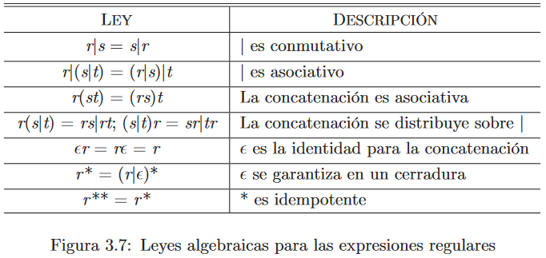

# Tokens
Los tokens son las unidades léxicas de un lenguaje.

# Índice

1. [Conceptos](#conceptos)
2. [Operaciones en los Lenguajes](#operaciones-en-los-lenguajes)
    1. [Unión](#unión)
    2. [Concatenación](#concatenación)
    3. [Cerradura de Kleene](#cerradura-de-kleene-l)
    4. [Cerradura Positiva](#cerradura-positiva-l)
3. [Expresiones Regulares](#expresiones-regulares)

## Conceptos
- **Alfabeto:** Conjunto finito de símbolos
- **Cadena:** Secuencia finita de símbolos de un alfabeto.
    - Dada una cadena S = *"camello"*
    - **Longitud de cadena:** $|S| = 7$ 
    - **Cadena Vacía:** $\epsilon = 0$
    - **Subcadena:** Tomar una cierta cantidad de caracteres consecutivos de la cadena.
        - el
    - **Prefijo:** Subcadena de 0 o más caracteres tomada del inicio de la cadena.
        - came
    - **Sufijo:** Subcadena de 0 o más caracteres tomada del final de la cadena.
        - ello
    - **Subsecuencia:** Quitar elementos de la cadena, no necesariamente consecutivos.
        - amo
- **Lenguaje:** Conjunto de cadenas de un alfabeto.
- **Concatenación:** Unión de dos o más cadenas.
    - Si **x** y **y** son dos cadenas, **xy** es la concatenación de ambas.

## Operaciones en los lenguajes

### Unión
Juntar dos o más conjuntos para hacer uno solo que contiene los elementos de ambos.

Esto hace referencia a la propiedad **Asociativa**, es decir, no importa como se asocien los elementos.

$$
A + B + C = (A + B) + C
$$

### Concatenación
Juntar dos o más conjuntos, en un orden específico, es decir

$$
AB \neq BA
$$

### Cerradura de Kleene L*

Sea L un lenguaje, L* es el conjunto de cadenas que ese obtiene de concatenar 0 o más veces caracteres del alfabeto.

Ej.

Si L = {A...Z}

L* = "ABC"

L* = "IAB"

L* = "" = $\epsilon$

### Cerradura Positiva L
Corresponde a $ L* - \epsilon$

Conjunto de caracteres del alfabeto de longitud 1 hacia $\infty$.

Si L = {A...Z}

L+ = "A"

L+ = "IBB"

L+ = "EF"

## Expresiones Regulares

Las expresiones regulares representan una manera de representar patrones de cadenas.

1. $(r)|(s)$ denota $L(r) \cup L(s)$
2. $(r)(s)$ denota $L(r)L(s)$
3. $(r)*$ denota $(L(r))*$
4. $(r)$ denota $L(r)$
    1. podemos agregar pares de paréntesis sin cambiar el lenguaje que denota.

- `*` tiene la mayor prioridad y es asociativo por la izquierda.
- La **concatenación** tiene la segunda prioridad más alta y es asociativa por la izquierda.
- `|` tiene la menor precedencia y es asociativo por la izquierda.

Una expresión regular **r** denota un Lenguaje L(r) que tiene un cierto alfabeto, es decir, podemos suplir un alfabeto por un solo símbolo que lo represente.

--- 
Por ejemplo, si L(r) = {a,b}

La expresión regular **rr** podría ser {aa, bb, ab, ba}

--- 

Si un lenguaje se puede describir mediante una expresión regular, se le llama un **conjunto regular**.